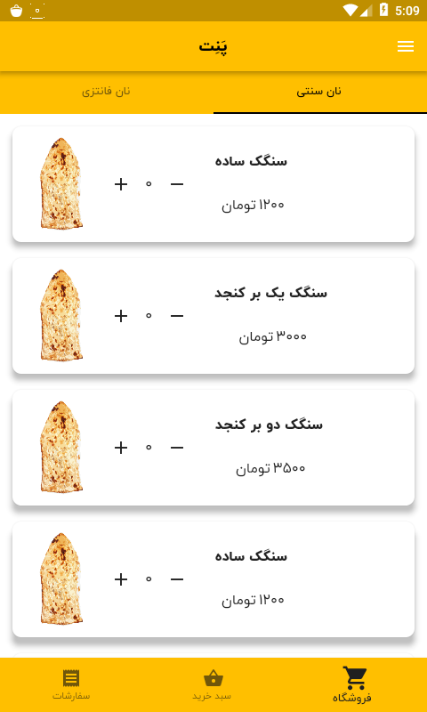
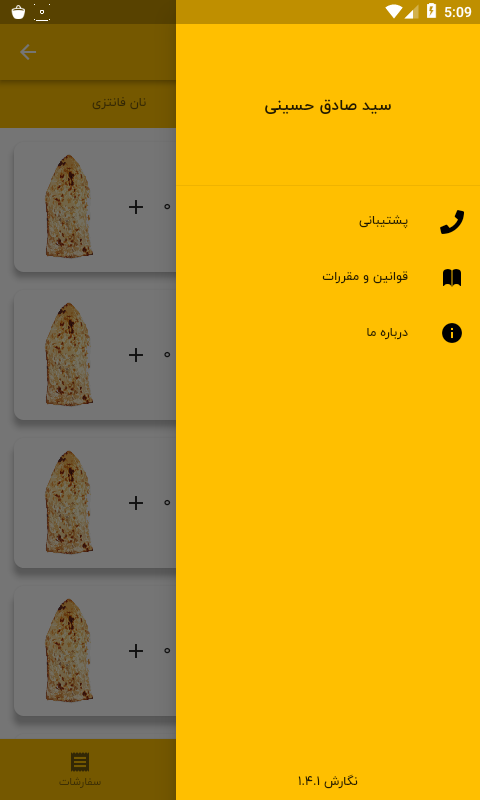
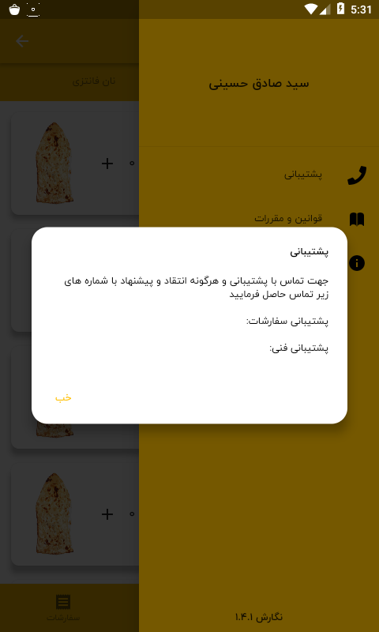

# Panet

A Bread ordering Application written with Dart Language And Flutter Framework.

<p float="left">
  
   
   
</p>

## How To Use

To clone and run this application, you'll need [Git](https://git-scm.com) and [Flutter](https://flutter.dev/docs/get-started/install) installed on your computer. From your command line:

```bash
# Clone this repository
$ git clone https://github.com/hosseiniii/Panet.git

# Go into the repository
$ cd Panet

# Install dependencies
$ flutter packages get

# Run the app
$ flutter run
```

## License

MIT

---

## Font License

IRANYekan fonts are considered a proprietary software. To gain information about the laws regarding the use of these fonts, please visit www.fontiran.com

> GitHub [@hosseiniii](https://github.com/hosseiniii) &nbsp;&middot;&nbsp;

